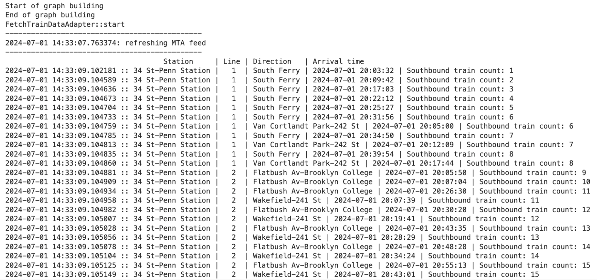
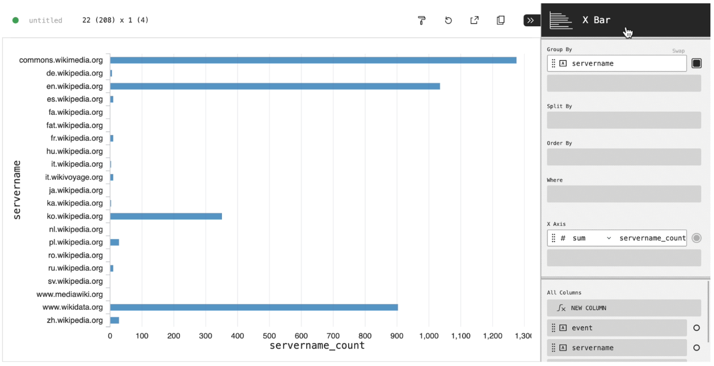
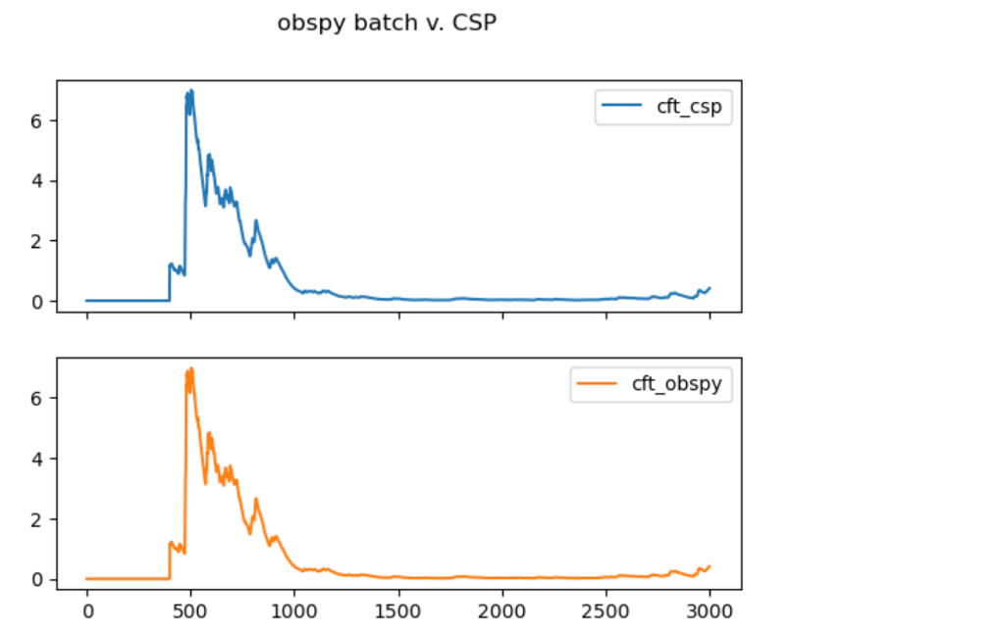
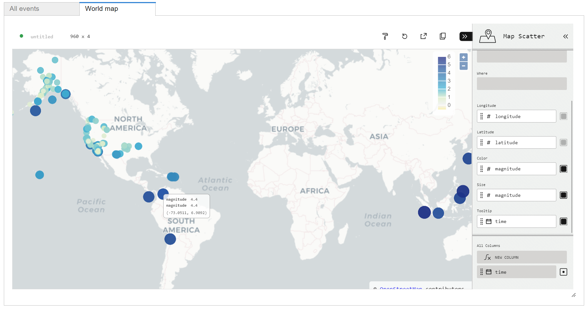

<picture>
  <source media="(prefers-color-scheme: light)" srcset="https://raw.githubusercontent.com/Point72/csp/main/docs/img/csp-light.png">
  <source media="(prefers-color-scheme: dark)" srcset="https://raw.githubusercontent.com/Point72/csp/main/docs/img/csp-dark.png">
  
</picture>

CSP (Composable Stream Processing) is a library for high-performance real-time event stream processing in Python.

## Key Features

- **Powerful C++ Engine:** Execute the graph using CSP's C++ Graph Processing Engine
- **Simulation (i.e., offline) mode:** Test workflows on historical data and quickly move to real-time data in deployment
- **Infrastructure-agnostic:** Connect to any data format or storage database, using built-in (Parquet, Kafka, etc.) or custom adapters
- **Library of built-in operations:** Write workflows quickly using CSP's built-in set of general, statistical, mathematical "nodes" that define common runtime computations
- **Highly-customizable:** Write your own input and output adapters for any data/storage formats, and real-time adapters for specific workflows
- **PyData interoperability:** Use your favorite libraries from the Scientific Python Ecosystem for numerical and statistical computations
- **Functional/declarative style:** Write concise and composable code for stream processing by building graphs in Python

## Get Started

- [Install CSP](Installation) and [write your first CSP program](First-Steps)
- Learn more about [nodes](CSP-Node), [graphs](CSP-Graph), and [execution modes](Execution-Modes)
- Learn to extend CSP with [adapters](Adapters)

## Applications

<table>
  <tr>
    <td>Real-time public transportation</td>
    <td>Tracking Wikipedia page edits</td>
    <td>Processing seismic waveforms</td>
    <td>Visualizing global earthquakes</td>
  </tr>
  <tr>
    <td>
      
    </td>
    <td>
      
    </td>
    <td>
      
    </td>
    <td>
      
    </td>
  </tr>
</table>

Check out the [examples directory](https://github.com/Point72/csp/tree/main/examples) for a comprehensive collection of CSP applications.

## Community

- [Contribute](Contribute) to CSP and help improve the project
- Read about future plans in the [project roadmap](Roadmap)

> \[!TIP\]
> Find relevant docs with GitHub’s search function, use `repo:Point72/csp type:wiki <search terms>` to search the documentation Wiki Pages.

## License

CSP is licensed under the Apache 2.0 license. See the [LICENSE](https://github.com/Point72/csp/blob/main/LICENSE) file for details.
